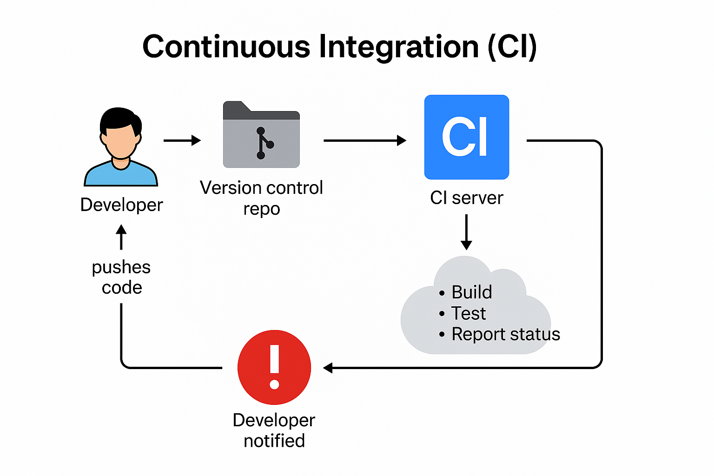
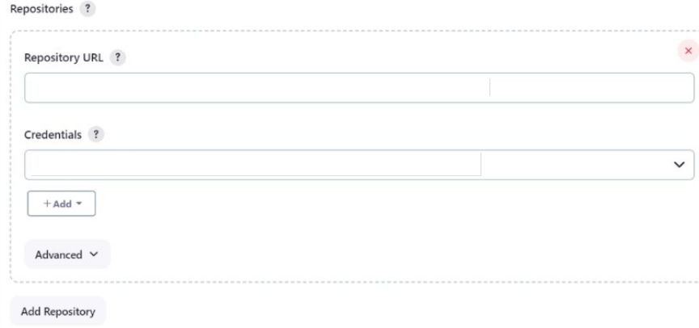

# Continuous Integration (CI)
Continuous Integration (CI) is a DevOps practice where developers regularly merge their code changes into a shared repository, and automated builds and tests are run to verify those changes



**Continuous integration / delivery, deployment**
- **Continuous integration** is refers to the build and unit testing stages of the software release process 
  Every revision that is committed triggers an automated build and test
- **Continuous Delivery** is the code is always releasable by release manager ​
It can't go to the next stage until approval by release manager ​
The release manager is such a Gate Keeper​
- **Continuous Deployment** is take the Continuous Delivery one step further​
whenever the developer committee code, after successful automatic testing it is deploy into production environment​
The process required high level confident on automatic pipeline ​
Team can response faster ​

## **Jenkins installation base on Docker image**
- Work local server - PreRequsite is Docker desktop installed

```
docker run -d --name jenkins -p 8080:8080 jenkins/jenkins
  # See the logs in case its not work
docker logs 13d3a0adddb1
  # You should delete the docker container id of jenkins
docker rm -f <container id>
sudo curl ifconfig.me
```
- Go to the browser and open a new tab http://host-ip:8080
- in docker cli run the below command and insert to the jenkins password page

### Open the **cli of WSL** and type the command below, it is not work with cli of Git Bash

```
  # from Git bash
docker logs jenkins
  # from WSL we can use cat command as well
docker exec jenkins cat /var/jenkins_home/secrets/initialAdminPassword
```


- Work remote server connection
  - Connect via ssh to the remote serve
```
export SERVER_IP="<your-infrastructure-server-ip>"
echo $SERVER_IP
```
- Run the block docker commands below
```
docker run -p 8080:8080 \
-p 50000:50000 \
-v jenkins_home:/var/jenkins_home \
--name jenkins \
--memory="3g" \
--restart=always \
--hostname="${SERVER_IP}" \
-d \
jenkins/jenkins:2.397
```
- Go to the browser
```
http://<Infrastructure-Server-Ip>:8080
  # Generate the password
docker exec jenkins cat /var/jenkins_home/secrets/initialAdminPassword
```
- log in as:
  - user=admin
  - password=admin

### Freestyle job
A Jenkins Freestyle job is a basic project type in Jenkins that allows you to run simple build, test, and deploy tasks. It is a good starting point for beginners to understand Jenkins automation

#### Lab 01 - Freestyle job

- Go to the **New Item** and choose **Freestyle project**
  Go to Build Steps -> Execute shell -> and type
```
echo "My first Freestyle job"
```
- Run the job
For more options:
- Build Triggers
    -  Example: check "Poll SCM" and enter H/5 * * * * to poll every 5 minutes

- Build Environment
    - Choose Delete workspace before build starts

## Lab 02 - Create pipeline based on Jenkinsfile
- **Docker run** based on lesson lesson-docker/practice-03/README.md
- for plugin page, go to slash **manage**

- **Set Master jenkins label to slave** go to Dashboard -> Manage Jenkins -> Nodes -> Built-In Node -> Configure
- **Set Credential Github user**  go to Dashboard -> Manage Jenkins -> Credentials -> System -> github
  
  **Note** ID = github_cred all other are github value
- make sure the url of jenkinsfile is** under yiur public repo** as https://github.com/your-profile>/your-repo.git
- make sure that you are on correct branch of jenkinsfile is correct  **main**
  


- **Install plugin blue ocean and stage view** go to Dashboard -> Manage Jenkins -> Plugins -> Availiable plugins
 

